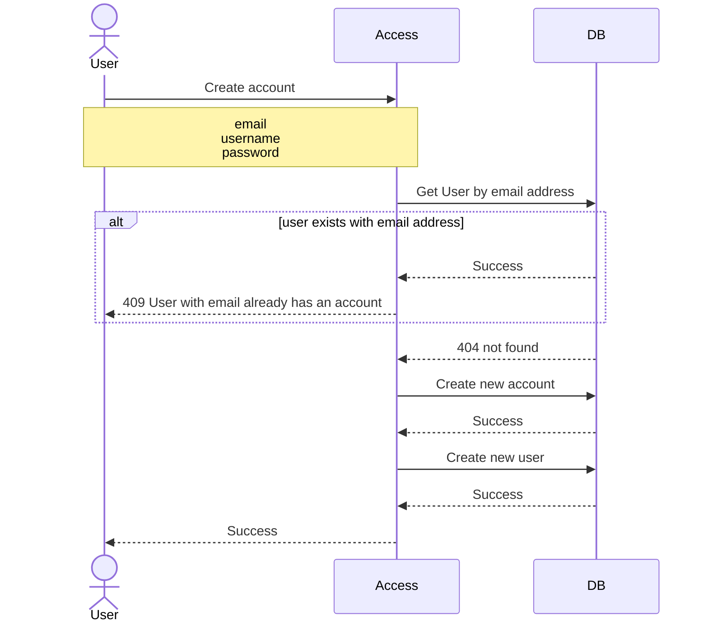

```mermaid
sequenceDiagram

actor User
participant A as Access
participant DB

User ->> A: Create account
Note over User,A: email<br>username<br>password

A ->> DB: Get User by email address
alt user exists with email address
    DB -->> A: Success
    A -->> User: 409 User with email already has an account
end

DB -->> A: 404 not found

A ->> DB: Create new account
DB -->> A: Success
A ->> DB: Create new user
DB -->> A: Success

A -->> User: Success
```
