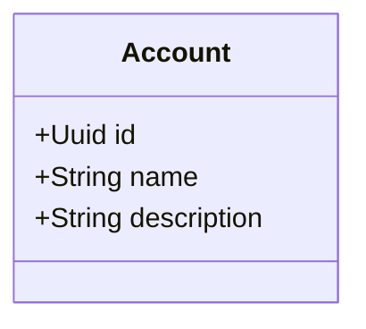
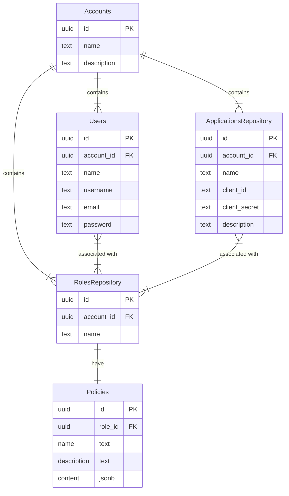

```mermaid
classDiagram

class Account {
    +Uuid id
    +String name 
    +String description
}
```

```mermaid
erDiagram
    Accounts {
        uuid id PK
        text name
        text description   
    }
    Users {
        uuid id PK
        uuid account_id FK
        text name
        text username
        text email
        text password
    }
    ApplicationsRepository {
        uuid id PK
        uuid account_id FK
        text name
        text client_id
        text client_secret
        text description
    }
    RolesRepository {
        uuid id PK
        uuid account_id FK
        text name
    }
    Policies {
        uuid id PK
        uuid role_id FK
        name text
        description text
        content jsonb
    }
    
    Accounts ||--|{ Users : contains
    Accounts ||--|{ ApplicationsRepository : contains
    Accounts ||--|{ RolesRepository : contains
    
    Users }|--|{ RolesRepository: "associated with"
    ApplicationsRepository }|--|{ RolesRepository: "associated with"
    
    RolesRepository ||--|| Policies : have
    
```
